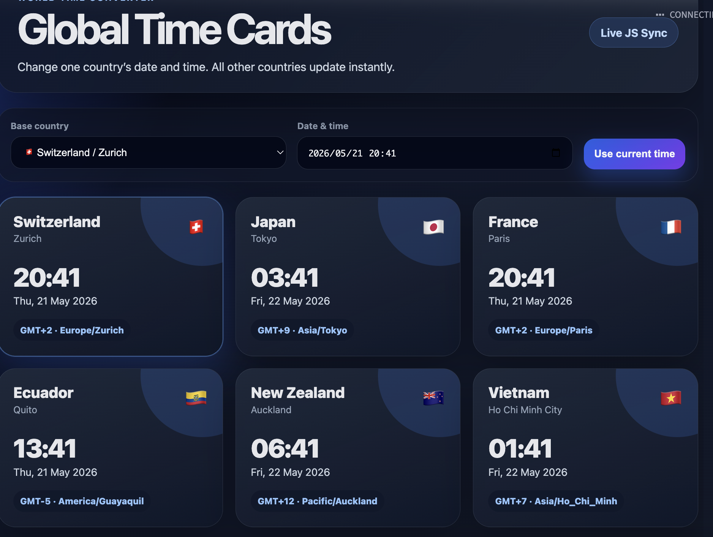

# World Time Cards - Streamlit

## Link:
https://zitatori-multi-timezone-tool-app-kjkvlb.streamlit.app/

A professional-looking world time converter built with Streamlit and JavaScript.
## Screenshot


## Features

- Card-style country UI
- Multiple countries/time zones
- Change one country's date and time
- Other countries update instantly
- Responsive professional layout

## Run locally

```bash
pip install -r requirements.txt
streamlit run app.py
```

## Customize countries

Edit the `countries` array inside `APP_HTML` in `app.py`.

Example:

```js
{ name: "Canada", city: "Toronto", flag: "🇨🇦", tz: "America/Toronto" }
```
